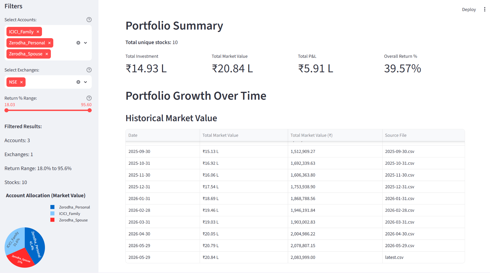
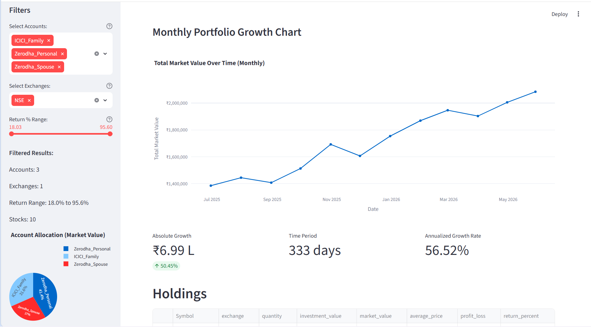
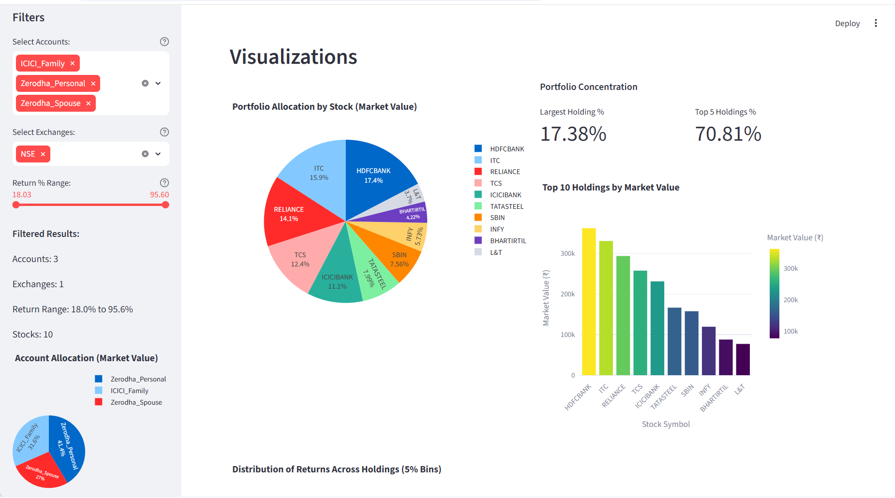

# 📊 TradeSight — Unified Family Wealth Tracker for Indian Brokers

**TradeSight** is a powerful, self-hosted orchestrator and analytical dashboard designed to consolidate stock portfolios across multiple Indian brokers (Zerodha Kite & ICICI Direct Breeze) into a unified family wealth interface.

---

## 🎯 The Core Problem
Many retail investors in India manage multiple demat accounts or track portfolios for the entire family (spouse, parents, siblings) across different brokers. 
**TradeSight solves the fragmentation problem.** Instead of logging into multiple apps or manual Excel tracking, TradeSight automatically syncs holdings, merges them securely, tracks historical value, and serves a beautiful, interactive analytical dashboard locally—**keeping your financial data 100% private.**

---

## 🖥️ Dashboard Preview

Here is a look at the interactive, self-hosted analytics dashboard fully populated with mock portfolio data:

### 📊 Portfolio Summary & Holdings
Detailed metrics including total investment, current market value, family P&L, overall returns %, and an account allocation pie chart.


### 📈 Historical Growth
Time-series growth mapping your total market value changes over months, with absolute and annualized CAGR growth calculations.


### 🎨 Risk & Distribution Analysis
In-depth visualizations including return distribution histograms (5% bins), portfolio concentration, and investment size vs. return bubble scatter plots.


---

## ✨ Key Features

- **🔗 Unified Family Holdings**: Consolidate holdings across multiple Zerodha (Kite API) and ICICI Direct (Breeze API) accounts seamlessly.
- **📈 Historical Growth Tracking**: Automatic, daily timestamped CSV storage creates a reliable, queryable time-series of your net worth over time.
- **🎨 Modern Analytics Dashboard**: Rich visualizations built in Streamlit and Plotly, showing:
  - **Account Allocation**: See which broker holds what portion of your family's net worth.
  - **Concentration Analysis**: Monitor risk with metrics like *Top 5 Holdings %* and *Largest Holding %*.
  - **Performance Breakdown**: Instantly spot your best and worst performers by absolute gain and return %.
  - **Bubble Scatter Plots**: Correlate investment sizes against returns with interactive tooltip breakdowns.
- **🛠️ Zero-Setup Demo**: Test-drive the dashboard immediately with our custom high-fidelity dummy data generator.

---

## 🏗️ Architecture & Project Structure

TradeSight is refactored with a clean separation of concerns, making it highly modular and extensible:

```
TradeSight/
├── auth/                           # Secure credentials & token management
│   ├── token_manager.py           # Handles session-based API tokens
│   └── manage_tokens.py           # Token utility scripts
├── core/                           # System core & configurations
│   └── broker_config.py           # Decoupled environment configuration loader
├── clients/                        # Decoupled API wrappers
│   ├── zerodha_client.py          # Zerodha Kite API client
│   └── icici_client.py            # ICICI Direct Breeze API client
├── utils/                          # Utility functions
│   ├── holdings_processor.py      # Standardizes raw broker data schemas
│   ├── file_exporter.py           # Handles daily-historical CSV folder structures
│   └── display_utils.py           # Sleek command-line logger formatting
├── data/                           # Data storage (Automatic / Gitignored)
│   └── consolidated_holdings/     # Unified multi-broker consolidated portfolio history
├── dashboard.py                   # Premium Streamlit portfolio dashboard
└── sync_holdings.py               # Main orchestration script
```

---

## 🚀 Quickstart

### 1. Installation
Clone the repository and install dependencies:
```bash
pip install -r requirements.txt
```

### 2. Zero-Setup Demo (Highly Recommended)
To preview the premium analytical dashboard instantly with high-fidelity mock data (diversified Indian blue-chips across multiple accounts and 12 months of simulated growth history):
```bash
# Generate premium mock portfolio history
python generate_dummy_data.py

# Launch the interactive dashboard
streamlit run dashboard.py
```

### 3. Production Multi-Broker Sync
To connect your active broker accounts:

1. **Configure Environment**: Copy `.env.example` to `.env` and fill in your API credentials:
   ```bash
   cp .env.example .env
   ```
2. **Execute Sync**: Run the orchestrator to fetch real-time holdings, handle authentication tokens, and export standard CSV data:
   ```bash
   python sync_holdings.py
   ```
3. **Launch Dashboard**: View your real-time unified family holdings:
   ```bash
   streamlit run dashboard.py
    ```

---

## 🗺️ Roadmap & Planned Features

To maintain a zero-cost, self-hosted operational model, TradeSight aims to leverage end-of-day (EOD) historical and 1-day-old free market data to deliver institutional-grade portfolio analytics. The following features are planned:

### 1. Sectoral Exposure & Smart Portfolio Rebalancing
- **Sector Classification**: Integrate with free metadata endpoints (like Yahoo Finance) to automatically classify holdings by industry and sector (e.g., Financial Services, IT, Energy, Consumer Goods).
- **Exposure Caps & Risk Alerts**: Visualize concentration risks across industries and trigger alerts if any single sector exceeds standard risk parameters.
- **Rules-Based Rebalancing**: Provide actionable, data-driven buy/sell recommendations to realign the portfolio with the user's targeted asset allocation profile.

### 2. Tax-Loss Harvesting Engine (Capital Gains Optimization)
- **FIFO Holding Period Analysis**: Track purchase dates and buy tranches of consolidated holdings to categorize assets into Long-Term Capital Gains (LTCG) and Short-Term Capital Gains (STCG) based on Indian taxation laws.
- **Harvesting Alerts**: Automatically identify underperforming positions with unrealized losses that can be strategically booked (harvested) to offset realized capital gains tax liabilities before the end of the financial year.

### 3. Risk-Adjusted Performance Metrics (Sharpe, Beta, & Volatility)
- **EOD Historical Benchmarking**: Pull historical daily closing prices for the past 1-3 years to compute key risk metrics:
  - **Portfolio Beta**: Benchmark consolidated systematic risk against major indices like Nifty 50 or Nifty Next 50.
  - **Sharpe & Sortino Ratios**: Measure risk-adjusted return efficiency.
  - **Maximum Drawdown**: Track peak-to-trough historical declines during market downturns.

### 4. Consolidated Dividend Yield & Income Projection
- **Corporate Action Mapper**: Map historical ex-dividend dates and payout values to catalog actual dividend income received across all family demat accounts.
- **Forward-Looking Cash Flow Projections**: Project expected annual dividend cash flows based on current holdings and historical payout distributions.

---

## 🔒 Security & Privacy First
TradeSight does not send your data to any third-party server. All credentials live inside your local environment (`.env`), and all holdings data is written to local CSV files (`data/`). 

---

## 🤝 Contributing
Adding support for new brokers (e.g., Groww, AngelOne, Upstox) is simple. Just create a new client in `clients/`, define standard parser functions in `utils/holdings_processor.py`, and register the broker type in `core/broker_config.py`.
